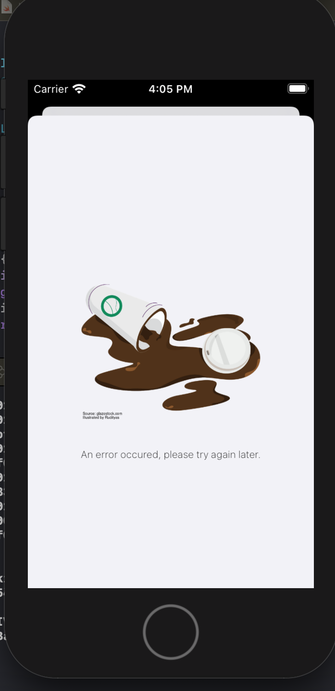
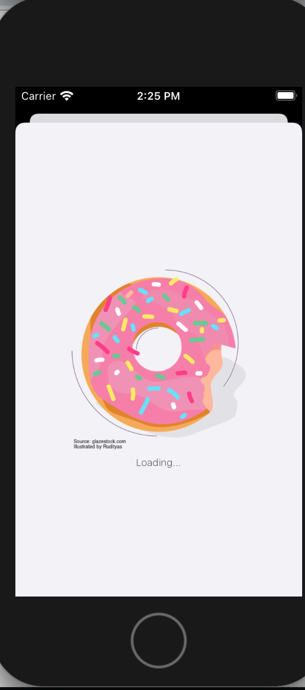
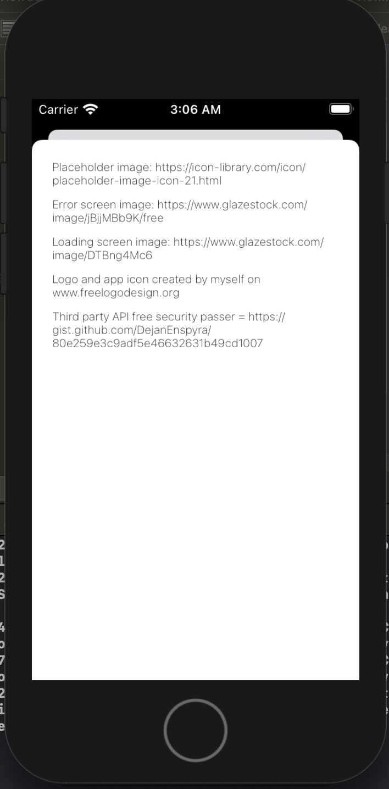

# Meal mate
An iOS app that shows images of recipies on searched items. Default search is yoghurt.
API from Spoonacular

## Additional notes
The API I choose (Spoonacular) https://spoonacular.com/ only allows 150 requests per day.

## What I would include if I had more time
I would add tests for the strings and viewModel. 
The API has a lot of different fields such as nutritional value, cusine and recipies. I would allow the user to click on the image to view the recipie in app. I would include a world map so a user could see cuisine all over the world. 

## Features
- Image Viewing
- Credit screen
- Loading screen
- Error Screen

## Screenshots

## Requirements
- iOS 8.0+
- Xcode 12.01

## Meta
Marie Harmsen – mk.harmsen@gmail.com
